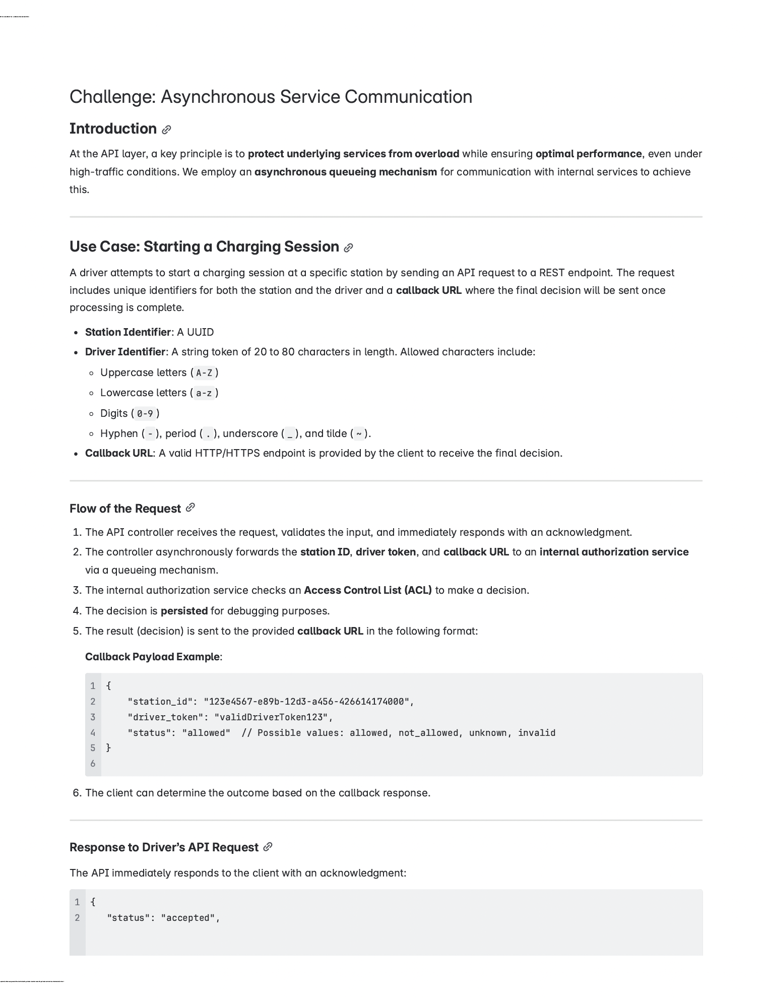

# asynchronous-service-communication 

## Task to implement



# Brief overview of the solution

The solution is written in python3 (django). Main parts are
1. API controller: a `django` web service. For details please check the 
   file `asynchronous_service_communication/views.py`). It works as follows: 
   - Receives request
   - validates input 
   - save the request in the `sqlite` database
   - push message (the primary key of the row just savaed) in `redis` for the 
     `celery` worker 
   - immediately responds with an acknowledgement that request is received 
2. `Internal Authorization Service`: a `celery` worker with `redis` as 
   message queue. For details please check the file 
   `asynchronous_service_communication/tasks.py` . It works as follows:
   - It pops message (i.e. primary key) from the queue. 
   - Fetch the request row saved from database
   - It then checks `Access Control List 
     (ACL)` to make a decision.
   - Modify the existing request in the database with the decision
   - Send a callback to the client informing the decision
3. A job that is running after every `x` seconds (`x` may vary). For detaisl 
   please check 
   - it fetches a list of requests that has both the characteristics 
     - created before `y` seconds (`y` may vary)
     - not got any decision from `Internal Authorization Service`
   - for each request of the above mentioned list
     - give each request decision as `unknown`
     - save the request in database
     - Send a callback to the client informing the decision


# How to run it 

For running main program or test cases you need to do the following things:
1. Python installation
2. Redis installation
3. Dependency installation

## Python installation
The solution is written in python3. If you don't have python3 in your 
machine, please install it. For details can check [python 3 download and 
installation](https://www.python.org/downloads/) 

## Redis installation
If redis is not installed, you need to install redis. Please follow [the 
link](https://redis.io/docs/latest/operate/oss_and_stack/install/archive/install-redis/) for redis installation.

### verifying redis installation
Once Redis is running, you should be able to get back a `PONG` if you send a 
`ping` to `redis-cli` in terminal
```
$ redis-cli ping
PONG
```

## Dependency installation
1. Please go to the root folder of this project.
2. Then run `python -m pip install -r requirements.txt`

## How to run test case
1. Please go to the root folder of this project.
2. Run `manage.py test`

If the tests passed, you should be able to see a output like this:
```
nafee.zahid@Mds-MacBook-Pro asynchronous-service-communication % ./manage.py test
Found 6 test(s).
System check identified no issues (0 silenced).
...Bad Request: /charge_point/session/
.Bad Request: /charge_point/session/
..
----------------------------------------------------------------------
Ran 6 tests in 0.058s

OK
```

If the test fails, you should be able to see a failure warning like this:
```
(.venv) nafee.zahid@Mds-MacBook-Pro asynchronous-service-communication % ./manage.py test
Found 6 test(s).
System check identified no issues (0 silenced).
...Bad Request: /charge_point/session/
FBad Request: /charge_point/session/
..
======================================================================
FAIL: test_get_request_should_post (asynchronous_service_communication.test_view.ViewTests)
----------------------------------------------------------------------
Traceback (most recent call last):
  File "/Users/nafee.zahid/Desktop/rootForHardDisk/personal/Career/recruitmentsInDifferentCompanies/chargePoint/asynchronous-service-communication/asynchronous_service_communication/test_view.py", line 56, in test_get_request_should_post
    self.assertDictEqual(
AssertionError: {'sta[25 chars]'Invalid request method. request is GET. But should be POST.'} != {'sta[25 chars]'Invalid request method. request is GET. But should be POST. '}
- {'error': 'Invalid request method. request is GET. But should be POST.',
+ {'error': 'Invalid request method. request is GET. But should be POST. ',
?                                                                       +

   'status': 'failed'}

----------------------------------------------------------------------
Ran 6 tests in 0.060s

FAILED (failures=1)

```


service_name=webservice/celery/command

celery run:
celery -A asynchronous_service_communication worker --loglevel=info


webhook link to receive the callback:
https://webhook.site/a02530e4-62e6-433b-ae31-d1392e823f12


python3 manage.py runserver


python3 manage.py give_decision_after_timeout


Check how many DecisionInstance are in DB:
len(DecisionInstance.objects.all())

for checking database
python manage.py shell

for importing DecisionInstance
from asynchronous_service_communication.models import DecisionInstance

Fetch DecisionInstance sorted by desc primary key 
DecisionInstance.objects.order_by('-pk').all()[start:end] [start, start+1, ..
..., end-2, end-1]
example: DecisionInstance.objects.order_by('-pk').all()[1:2]


Before running test.
need to run this in terminal.
export DJANGO_SETTINGS_MODULE=asynchronous_service_communication.settings

Then run test suite: 
./manage.py test